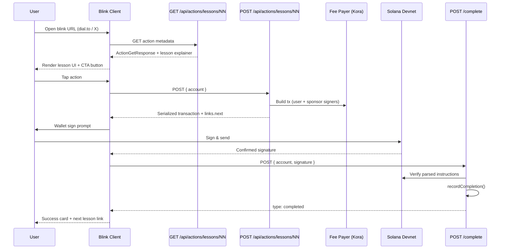

# LessonBlinks — System Architecture

**Product:** LessonBlinks (EN) · BlinkDers (TR)  
**Version:** MVP 1.0  
**Last updated:** 2026-06-09  
**Status:** Ready for implementation

---

## 1. Overview

LessonBlinks turns Solana Actions (Blinks) into **30-second micro-lessons**. Each lesson is a single Action endpoint: the user reads inline explainer copy, taps one button, signs one transaction, and receives a completion state. Five lessons form a Turkey-first, USDC-first curriculum ending in a graduation cNFT.

### Design principles

| Principle | Implementation |
|-----------|----------------|
| **USDC-first** | Lessons 1–3 use devnet USDC; SOL is introduced only in Lesson 4 (swap) |
| **Gas sponsorship** | Backend fee payer (Kora / treasury wallet) for Lessons 1–3 and 5 |
| **Embedded wallet** | Privy email/social signup; Phantom MWA as fallback |
| **Devnet-first MVP** | All lessons runnable on devnet before mainnet promotion |
| **Education = distribution** | Blinks unfurl in X, dial.to, Dialect registry |

---

## 2. Technology stack

| Layer | Choice | Version / notes |
|-------|--------|-----------------|
| Framework | **Next.js App Router** | 15.x |
| Actions SDK | **@solana/actions** | `createActionHeaders`, `createPostResponse` |
| Solana client | **@solana/web3.js** | Connection, Transaction, VersionedTransaction |
| SPL tokens | **@solana/spl-token** | USDC transfers, ATA creation |
| Swap | **Jupiter lite API** | Lesson 4 only; devnet mock or mainnet flag |
| NFT mint | **@metaplex-foundation/mpl-bubblegum** | Lesson 5 cNFT |
| Wallet | **Privy** embedded + Phantom MWA | Email OTP for Turkey cohort |
| Gas sponsorship | **Kora** or custom fee-payer | `FEE_PAYER_SECRET_KEY` env |
| RPC | **Helius** devnet + mainnet | `SOLANA_RPC_URL` |
| Database | **Supabase Postgres** | Lesson completions, graduates |
| Analytics | **PostHog** or Vercel Analytics | Event schema in `ANALYTICS.md` |
| Hosting | **Vercel** | Edge-friendly Action routes |
| Registry | **Dialect** (`dial.to`) | `actions.json` at domain root |

### Devnet constants

```typescript
export const DEVNET_USDC_MINT = "4zMMC9srt5Ri5X14GAgXhaHii3GnPAEERYPJgZJDncDU";
export const DEVNET_CLUSTER = "devnet" as const;
export const COURSE_ID = "lessonblinks-101";
```

---

## 3. High-level architecture

```
┌──────────────────────────────────────────────────────────────────────────┐
│                         Distribution layer                                │
│  X / Farcaster    dial.to interstitial    Dialect registry    QR links   │
└────────────────────────────────────┬─────────────────────────────────────┘
                                     │ HTTPS GET/POST/OPTIONS
                                     ▼
┌──────────────────────────────────────────────────────────────────────────┐
│                    Next.js 15 App Router (Vercel)                         │
│  ┌─────────────┐  ┌──────────────────────┐  ┌────────────────────────┐ │
│  │ actions.json│  │ /api/actions/lessons │  │ /lesson/[slug] pages   │ │
│  │ (public)    │  │ 01..05 route handlers│  │ (marketing fallback)   │ │
│  └─────────────┘  └──────────┬───────────┘  └────────────────────────┘ │
│                              │                                            │
│  ┌───────────────────────────┴────────────────────────────────────────┐ │
│  │ lib/lessons · lib/solana · lib/sponsor · lib/completion · lib/i18n  │ │
│  └───────────────────────────┬────────────────────────────────────────┘ │
└──────────────────────────────┼──────────────────────────────────────────┘
                               │
         ┌─────────────────────┼─────────────────────┐
         ▼                     ▼                     ▼
┌─────────────────┐  ┌─────────────────┐  ┌─────────────────┐
│ Helius RPC      │  │ Supabase        │  │ Privy / Kora    │
│ (devnet)        │  │ completions DB  │  │ embedded wallet │
└─────────────────┘  └─────────────────┘  └─────────────────┘
         │
         ▼
┌─────────────────────────────────────────────────────────────────────────┐
│ Solana devnet                                                            │
│  USDC mint 4zMMC9… · Jupiter (L4) · Bubblegum tree (L5)                 │
└─────────────────────────────────────────────────────────────────────────┘
```

---

## 4. Folder structure

```
blinks-micro-lessons/
├── public/
│   ├── actions.json                    # Blink path → API mapping (also served via route)
│   └── lessons/
│       ├── 01/icon.png                 # 512×512 per lesson
│       ├── 02/icon.png
│       ├── 03/icon.png
│       ├── 04/icon.png
│       └── 05/icon.png
├── src/
│   ├── app/
│   │   ├── layout.tsx
│   │   ├── page.tsx                    # Landing: curriculum overview
│   │   ├── actions.json/route.ts       # CORS-wrapped actions.json
│   │   ├── lesson/
│   │   │   ├── 01-usdc-transfer/page.tsx
│   │   │   ├── 02-tip-creator/page.tsx
│   │   │   ├── 03-remittance/page.tsx
│   │   │   ├── 04-swap/page.tsx
│   │   │   └── 05-graduation/page.tsx
│   │   └── api/
│   │       └── actions/
│   │           └── lessons/
│   │               ├── 01-usdc-transfer/
│   │               │   ├── route.ts          # GET, POST, OPTIONS
│   │               │   └── complete/route.ts # Chained completion callback
│   │               ├── 02-tip-creator/
│   │               │   ├── route.ts
│   │               │   └── complete/route.ts
│   │               ├── 03-remittance/
│   │               │   ├── route.ts
│   │               │   └── complete/route.ts
│   │               ├── 04-swap/route.ts
│   │               └── 05-graduation-nft/
│   │                   ├── route.ts
│   │                   └── complete/route.ts
│   └── lib/
│       ├── actions/
│       │   ├── headers.ts              # createActionHeaders() singleton
│       │   └── errors.ts               # toActionError(), LessonError
│       ├── lessons/
│       │   ├── types.ts                  # LessonId, LessonExplainerMetadata
│       │   ├── constants.ts            # mints, amounts, course id
│       │   ├── lesson-01.ts … lesson-05.ts
│       │   └── i18n/
│       │       ├── en.ts
│       │       └── tr.ts                 # BlinkDers copy
│       ├── solana/
│       │   ├── connection.ts
│       │   ├── usdc.ts                   # transfer, ATA helpers
│       │   └── verify.ts                 # Parsed tx verification
│       ├── sponsor/
│       │   └── fee-payer.ts              # Gas sponsorship tx builder
│       ├── jupiter/
│       │   └── swap.ts                   # Lesson 4 only
│       ├── graduation/
│       │   ├── bubblegum.ts
│       │   └── prerequisites.ts
│       ├── completion/
│       │   └── record.ts                 # DB + webhook
│       └── analytics/
│           └── emit.ts
├── scripts/
│   ├── setup-graduation-tree.ts
│   └── fund-devnet-usdc.ts
├── docs/                               # This documentation set
└── package.json
```

---

## 5. Data flow — single lesson (Action chaining)

Lessons 1–3 and 5 use the **GET → POST → on-chain confirm → POST complete** pattern.



### Lesson 4 (swap)

Swap uses GET → POST without a completion callback in MVP (optional V2). Jupiter returns a `VersionedTransaction`; user is fee payer unless sponsorship is enabled for swap fees.

---

## 6. Action route contract

Every lesson route implements:

| Method | Purpose |
|--------|---------|
| `OPTIONS` | CORS preflight via `createActionHeaders()` |
| `GET` | `ActionGetResponse` with `lesson` extension block |
| `POST` | `ActionPostResponse` with signable transaction |

### Extended GET response shape

```typescript
interface LessonActionGetResponse extends ActionGetResponse {
  lesson: {
    lessonId: "lesson-01" | "lesson-02" | "lesson-03" | "lesson-04" | "lesson-05";
    lessonNumber: number;
    locale: "en" | "tr";
    learningObjectives: string[];
    explainer: { headline: string; steps: LessonStep[] };
    completion: { badgeLabel: string; nextLessonActionHref?: string };
  };
}
```

Blink clients ignore unknown keys; lesson-aware landing pages read `lesson`.

---

## 7. Gas sponsorship model

| Lesson | User pays | Sponsor pays |
|--------|-----------|--------------|
| 1 USDC transfer | $1 USDC (from faucet/airdrop) | Network fee + ATA rent (if needed) |
| 2 Tip creator | $0.10 USDC tip | Network fee |
| 3 Remittance | $0.50 USDC send | Network fee |
| 4 Swap | 0.01 SOL swap + fees | Optional priority fee cap |
| 5 Graduation NFT | $0 (sponsored mint) | Mint + network fee |

**Implementation:** `lib/sponsor/fee-payer.ts` loads `FEE_PAYER_SECRET_KEY`, sets `transaction.feePayer = sponsorKeypair.publicKey`, partial-signs before returning to client. User still signs as authority for token transfers.

**Guardrails:**

- Daily sponsor budget cap (`SPONSOR_DAILY_LAMPORTS_CAP`)
- Per-wallet rate limit (5 lessons/hour)
- Devnet-only until treasury funded for mainnet

---

## 8. Embedded wallet integration

```
User lands on blinkders.com/tr
  → Privy modal: email or Google
  → Embedded Solana wallet created (no seed phrase shown)
  → Optional: auto-request devnet USDC from project faucet API
  → Blink client uses embedded wallet pubkey as POST { account }
```

| Provider | Role |
|----------|------|
| Privy | Auth + embedded Solana wallet |
| Phantom MWA | Power users, extension fallback |
| Project faucet | `POST /api/faucet/usdc` — 5 USDC/devnet/wallet/day |

Privy is **not** in the critical path for Blink clients that bring their own wallet (Phantom on X). Embedded wallet is for the BlinkDers web landing and Turkey paid-social campaigns.

---

## 9. Completion registry

```sql
CREATE TABLE lesson_completions (
  wallet        TEXT NOT NULL,
  lesson_id     TEXT NOT NULL,       -- lesson-01 .. lesson-05
  signature     TEXT NOT NULL UNIQUE,
  amount_usdc   NUMERIC,
  network       TEXT DEFAULT 'devnet',
  locale        TEXT DEFAULT 'en',
  completed_at  TIMESTAMPTZ DEFAULT NOW(),
  verified      BOOLEAN DEFAULT FALSE,
  PRIMARY KEY (wallet, lesson_id)
);

CREATE TABLE graduates (
  wallet          TEXT PRIMARY KEY,
  asset_id        TEXT,
  mint_signature  TEXT NOT NULL,
  minted_at       TIMESTAMPTZ DEFAULT NOW()
);
```

Completion is recorded in the `/complete` callback after **on-chain instruction verification** — never from client assertions alone.

---

## 10. Internationalization

| Surface | EN | TR |
|---------|----|----|
| Product name | LessonBlinks | BlinkDers |
| GET `title` / `description` | `lib/lessons/i18n/en.ts` | `lib/lessons/i18n/tr.ts` |
| Query param | `?locale=en` (default) | `?locale=tr` |

Turkey-first launch uses `locale=tr` as default when `Accept-Language` starts with `tr` or `?country=TR`.

---

## 11. Environment variables

```bash
# App
NEXT_PUBLIC_BASE_URL=https://lessonblinks.com
NEXT_PUBLIC_PRODUCT_NAME=LessonBlinks

# Solana
SOLANA_RPC_URL=https://devnet.helius-rpc.com/?api-key=...
SOLANA_CLUSTER=devnet
DEVNET_USDC_MINT=4zMMC9srt5Ri5X14GAgXhaHii3GnPAEERYPJgZJDncDU

# Wallets
FEE_PAYER_SECRET_KEY=...          # Gas sponsor
FAUCET_AUTHORITY_SECRET_KEY=...   # Devnet USDC faucet
MINT_AUTHORITY_SECRET_KEY=...     # Lesson 5 cNFT
CREATOR_WALLET_PUBKEY=...         # Lesson 2 tip recipient
REMITTANCE_DEMO_WALLET=...        # Lesson 3 demo recipient

# Graduation
MERKLE_TREE=...
GRADUATE_METADATA_URI=https://...

# Auth & infra
PRIVY_APP_ID=...
DATABASE_URL=postgresql://...
HELIUS_WEBHOOK_SECRET=...
POSTHOG_API_KEY=...

# Feature flags
ENABLE_MAINNET=false
ENABLE_GAS_SPONSOR=true
```

---

## 12. Deployment topology

| Environment | URL | Cluster | Notes |
|-------------|-----|---------|-------|
| Local | `localhost:3000` | devnet | Faucet + sponsor keys in `.env.local` |
| Preview | `*.vercel.app` | devnet | PR previews; Inspector testing |
| Production | `lessonblinks.com` | devnet → mainnet | Dialect registry points here |

**Deploy checklist:** `actions.json` accessible at root, all Action URLs HTTPS, CORS on every handler, icons 512×512 PNG, Blinks Inspector pass.

---

## 13. Security boundaries

| Trust boundary | Rule |
|----------------|------|
| Client → POST body | Validate `account` as `PublicKey` only |
| Client → query params | Never trust `amount`; use server constants |
| Completion callback | Verify parsed instructions on-chain |
| Sponsor keys | Server-only; never `NEXT_PUBLIC_*` |
| Faucet | Rate-limited; devnet only |

See `SECURITY.md` for the full must-fix checklist.

---

## 14. Related documents

| Doc | Contents |
|-----|----------|
| `CURRICULUM.md` | Five lessons, Turkey-first order |
| `PRODUCT-REVIEW.md` | USDC-first, gas, embedded wallet decisions |
| `specs/lesson-*.md` | Per-lesson implementation specs |
| `DEVNET-CHECKLIST.md` | End-to-end testing |
| `GTM.md` | Dialect registry + launch |

---

## 15. References

- [Solana Actions & Blinks](https://solana.com/developers/guides/advanced/actions)
- [@solana/actions npm](https://www.npmjs.com/package/@solana/actions)
- [Dialect registry](https://dial.to/register)
- [Circle devnet USDC faucet](https://faucet.circle.com/)