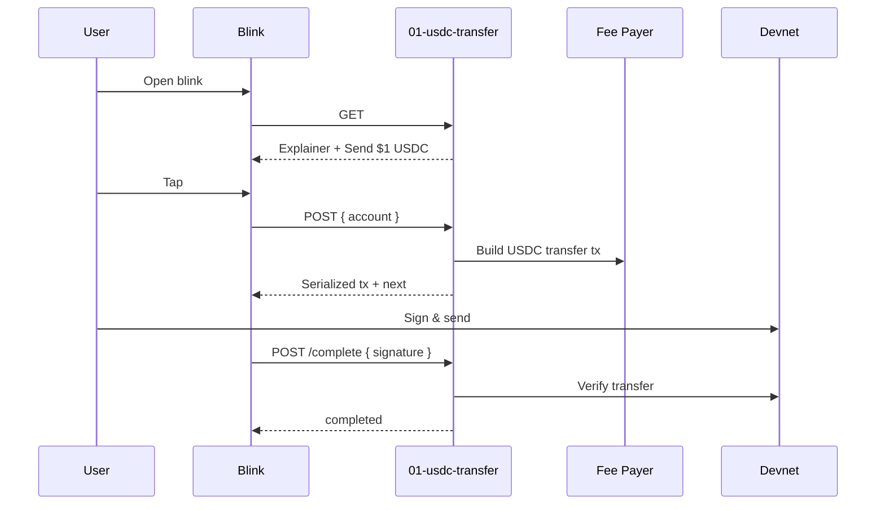

# Lesson 1 — Send $1 USDC

**Project:** LessonBlinks / BlinkDers  
**Lesson ID:** `lesson-01`  
**Date:** 2026-06-09  
**Status:** Ready for implementation  
**Spec version:** 1.0

---

## One-liner

Lesson 1 teaches SPL stablecoin transfers by having the learner send **$1 USDC** to a designated savings address on devnet, with gas sponsorship and inline explainer copy.

---

## Learning objectives

After completing this blink, the learner should understand:

1. USDC is a dollar-pegged **stablecoin** on Solana (not volatile like SOL).
2. Token transfers use **SPL Token** program, not `SystemProgram.transfer`.
3. A **token account (ATA)** may be created automatically on first receive.
4. Blinks combine education and action in one social feed tap.

---

## Action surface

| Field | Value |
|-------|-------|
| Blink URL | `https://{domain}/lesson/01-usdc-transfer` |
| Action API | `https://{domain}/api/actions/lessons/01-usdc-transfer` |
| Callback API | `https://{domain}/api/actions/lessons/01-usdc-transfer/complete` |
| Chain | Solana devnet |
| USDC mint | `4zMMC9srt5Ri5X14GAgXhaHiiQ2PysUac9mKNkHjWwy6` |
| Transfer amount | **$1 USDC** = `1_000_000` base units (6 decimals) |
| Recipient | User's own `savings` ATA or `?to=` self-transfer demo wallet |

---

## Constants

```typescript
export const DEVNET_USDC_MINT = new PublicKey(
  "4zMMC9srt5Ri5X14GAgXhaHiiQ2PysUac9mKNkHjWwy6",
);
export const LESSON_01_AMOUNT_USDC = 1;
export const LESSON_01_AMOUNT_BASE = 1_000_000; // 6 decimals
export const USDC_DECIMALS = 6;
```

---

## File layout

```
src/app/api/actions/lessons/01-usdc-transfer/
├── route.ts              # GET, POST, OPTIONS
└── complete/route.ts     # Chained completion
src/lib/lessons/lesson-01.ts
public/lessons/01/icon.png
```

---

## GET handler

### Query parameters

| Param | Required | Description |
|-------|----------|-------------|
| `to` | No | Recipient wallet; default = sender's savings sub-wallet or same-wallet ATA demo |
| `locale` | No | `en` (default) or `tr` |
| `ref` | No | Campaign analytics |

### Response (EN)

```typescript
const payload: LessonActionGetResponse = {
  type: "action",
  icon: new URL("/lessons/01/icon.png", origin).toString(),
  title: "Lesson 1 · Send $1 USDC",
  description: [
    "USDC stays close to $1 — it's a stablecoin for payments, not trading.",
    "",
    "You'll send exactly $1 USDC. Gas fee is sponsored by LessonBlinks.",
    "",
    "Steps:",
    "1. Connect wallet — holds your USDC",
    "2. Review transfer — $1 USDC to your savings address",
    "3. Confirm — lands in seconds",
  ].join("\n"),
  label: "Send $1 USDC",
  links: {
    actions: [
      {
        type: "transaction",
        label: "Send $1 USDC",
        href: `${baseHref}&amount=1`,
      },
    ],
  },
  lesson: LESSON_01_EXPLAINER,
};
```

### Response (TR)

```
title: "Ders 1 · 1 USDC Gönder"
label: "1 USDC Gönder"
description: USDC, 1 dolara yakın kalır. İşlem ücreti BlinkDers sponsorlu.
```

---

## POST handler

### Behavior

1. Validate `body.account` as `PublicKey`.
2. Reject `amount !== 1` (query param).
3. Resolve sender USDC ATA; create if missing (sponsor pays rent when `ENABLE_GAS_SPONSOR`).
4. Resolve recipient USDC ATA for `to` pubkey.
5. Check sender balance ≥ `1_000_000` USDC.
6. Build `createTransferCheckedInstruction` (preferred) or `createTransferInstruction`.
7. Set `feePayer` = sponsor keypair when gas sponsored.
8. Return `createPostResponse` with `links.next` → `/complete`.

### Transaction construction

```typescript
import {
  createAssociatedTokenAccountIdempotentInstruction,
  createTransferCheckedInstruction,
  getAssociatedTokenAddressSync,
} from "@solana/spl-token";

const senderAta = getAssociatedTokenAddressSync(DEVNET_USDC_MINT, account);
const recipientAta = getAssociatedTokenAddressSync(DEVNET_USDC_MINT, toPubkey);

const ix = [
  createAssociatedTokenAccountIdempotentInstruction(
    feePayer.publicKey,
    recipientAta,
    toPubkey,
    DEVNET_USDC_MINT,
  ),
  createTransferCheckedInstruction(
    senderAta,
    DEVNET_USDC_MINT,
    recipientAta,
    account,
    LESSON_01_AMOUNT_BASE,
    USDC_DECIMALS,
  ),
];
```

### Validation rules

| Check | Error message |
|-------|---------------|
| Invalid `account` | `Invalid "account" provided` |
| `amount !== 1` | `Lesson 1 requires exactly $1 USDC` |
| Insufficient USDC | `You need at least $1 USDC. Use the faucet first.` |
| Invalid `to` | `Invalid input query parameter: to` |

---

## Complete callback

### Verification

1. `getParsedTransaction(signature)`
2. Assert `spl-token` transfer or transferChecked:
   - `mint === 4zMMC9srt5Ri5X14GAgXhaHiiQ2PysUac9mKNkHjWwy6`
   - `amount === 1_000_000`
   - `authority === account`
3. `recordCompletion({ lessonId: "lesson-01", wallet, signature })`

### Success response

```typescript
{
  type: "completed",
  title: "Lesson 1 complete — you sent $1 USDC!",
  label: "USDC Sender",
  description: "You made your first stablecoin transfer on Solana. Next: tip a creator.",
  lesson: {
    lessonId: "lesson-01",
    lessonNumber: 1,
    completed: true,
    signature,
    nextLessonActionHref: "/api/actions/lessons/02-tip-creator",
  },
}
```

---

## End-to-end flow



---

## Environment variables

| Variable | Required |
|----------|----------|
| `DEVNET_USDC_MINT` | Yes (default constant) |
| `FEE_PAYER_SECRET_KEY` | Yes if gas sponsored |
| `SOLANA_RPC_URL` | Yes |
| `SOLANA_CLUSTER` | `devnet` |

---

## Testing

| # | Test | Expected |
|---|------|----------|
| 1 | GET default | 200, lesson block, single action |
| 2 | GET `?locale=tr` | Turkish copy |
| 3 | POST `?amount=2` | 400 |
| 4 | POST valid | Transfer tx, sponsored fee |
| 5 | Complete valid sig | `type: completed` |
| 6 | Complete wrong mint | 400 |
| 7 | Inspector | Pass |
| 8 | User 0 SOL, 2 USDC | Succeeds (sponsored) |

---

## Dialect registry

| Field | Value |
|-------|-------|
| Title | LessonBlinks 1: Send $1 USDC |
| Category | Education / Onboarding |
| Action URL | `https://{domain}/api/actions/lessons/01-usdc-transfer` |

---

## Out of scope

- Custom transfer amounts
- Mainnet USDC (`EPjFWdd5AufqSSqeM2qN1xzybapC8G4wEGGkZwyTDt1v`) until flag enabled
- Cross-chain USDC